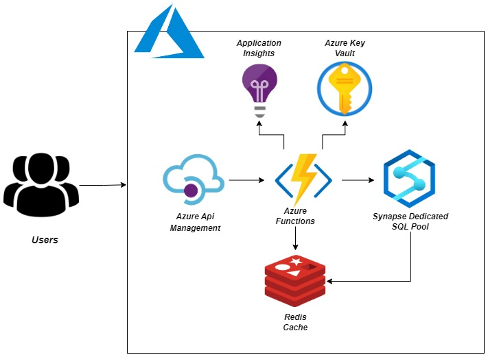

# Introduction

The main idea behind this project is to expose data residing in a persistence store through web services in order to make sure that the downstream users of the data remain as isolated as possible from the services storing the data. The above idea is materialized by creating a Flask based application which is hosted on Azure Function App service in order to make it serverless. This Function App reads data from an internal table hosted in Synapse Dedicated SQL Pool. In order to make this entire setup scalable at an enterprise level, a cache layer is used using Redis Cache which is an in memory database and hence provides retrieval of data in O(1)

# Design and Implementation

Following steps are taken to reach at a scalable and repeatable working solution:
1. An Azure Function App is created to host the serverless Flask Application
2. A Function is created inside the Function App which has `HTTP/HTTPS` defined as the sole trigger responsible for triggering the application
3.  A Flask App is created inside the Function App's Function that uses `WsgiMiddleware`, which redirects the invocations to Flask handler through the following function:
```python
# Function which listens and performs action on Http based trigger
def  main(req: func.HttpRequest,context: func.Context) -> func.HttpResponse:
	return  func.WsgiMiddleware(app.wsgi_app).handle(req,context)
```
4. The Function App is integrated with the Azure Key Vault which holds the credentials for connectivity with both Synapse and Redis Cache using the following steps 
			   Creation of Azure Key Vault if it does not exist  
			- Enabling system assigned managed identity for Azure Function App  
			- In the Azure Key Vault, addition of access policy for the Azure Function Managed Identity with all the required permissions  
			-  Addition of secrets in the Azure Key Vault  
			-  Getting hold of the secret identifiers for the secrets added  
			-  Going to the Azure functions to add the secret identifier in the application settings by adding a new  
			application setting with the name equal to what is being used in the code for fetching the credentials using the environment variables and value as the secret identifier that is received from Azure Key Vault. The value of the application setting should be provided in the following format:  `@Microsoft.KeyVault(SecretUri=<Secret Identifier>) `
		
5. The Function App is integrated with a table hosted in *Synapse Dedicated SQL Pool* using the *OJDBC* driver along with credentials such as *username*, *password*, *database name* , *port number* etc. Most of these credentials containing sensitive information are fetched from the Azure Key Vault

6. The Function App is integrated with *Redis Cache* using credentials such *Redis host name*, *access key*, *port, encryption* type etc.  Again, most of these credentials containing sensitive information are fetched from the Azure Key Vault

7. REST Endpoints are created to create multiple routes in the Flask Application to serve multiple purposes. For now, there are only two routes which are serving the following purposes:
		- ***Route*** : `/patientNames` This route should be invoked using the `GET` request. This route when invoked first goes to the configured cache and sees whether the cache contains a `HashMap` named `PatientNames` and Key : `NameKey` . If such a `HashMap`  with the desired key exists then it gives user the result from the cache and exits. However if the `HashMap` does not exist then the function fetches the result from the Synapse table using *OJDBC* driver and the results are cached in `HashMap` named `PatientNames` with Key : `NameKey`. In addition, an expiration policy of choice (by default 60 seconds) is also defined on the cache in order make sure that the cached results are not stale. 
		-  ***Route*** : `/patientDetails/<patient_attribute>`. This route should be invoked using the `POST` request. This route when invoked should be provided with a JSON as a payload specifying the department to which the patient should belong as `{"department" : <department_name>}`. In addition to this the endpoint should contain a dynamic attribute like `PatientId`,`PatientName` which refer to one of the columns in the Synapse table. For a given `<patient_attribute>` and `payload` for instance `<patient_attribute>` = `PatientId` and payload `{"department" : Ortho}`, the endpoint fetches all the patient ids from the synapse table or the cache(if it contains the hashed responses) that belong the Ortho department. Again, in order to make the endpoint scalable at an enterprise level, first it is determined that whether a `HashMap` named `<patient_attribute>_Dept_<patient_department>` exists or not. If such a `HashMap`  with the desired key exists then it gives user the result from the cache and exits. However if the `HashMap` does not exist then the function fetches the result from the Synapse table using *OJDBC* driver and the results are cached in `HashMap` named `<patient_attribute>_Dept_<patient_department>`with Key : `<patient_attribute>`. In addition, again an expiration policy of choice (by default 60 seconds) is also defined on the cache in order make sure that the cached results are not stale. 

The architecture diagram attached below explains the design and working of the implementation pictorially 

<p align="center">
  
</p>

# Testing and Validation

A python script (`\test_script\test_rest_api.py`)  is prepared to validate the results received through the REST endpoints. It makes request to both the endpoints using the requests module in python and then compares the JSON returned by the REST endpoints with the expected data. If the actual and expected data are in sync then the script gracefully exists otherwise it renders a detailed response mentioning the difference between the actual and expected results


